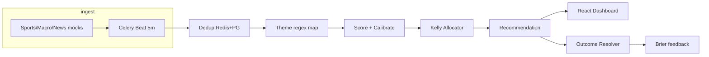

# Chronos (invest-agent)

[](https://github.com/ARasugit20/Chronos/actions/workflows/ci.yml)
[](https://chronos-api.onrender.com/api/v1/health)
[](https://chronos-frontend.onrender.com)
[](https://www.python.org/)
[](https://fastapi.tiangolo.com/)
[](LICENSE)

**Event-driven quant research agent** that ingests news/sports/macro events, maps them to ticker themes, scores probability, sizes positions with Kelly caps, and surfaces buy/skip recommendations with full audit provenance.

Repository: [https://github.com/ARasugit20/Chronos](https://github.com/ARasugit20/Chronos)

---

## Why this project (recruiter snapshot)

| Highlight | What it demonstrates |
|-----------|-------------------|
| **Full-stack ownership** | FastAPI + Celery + PostgreSQL + Redis + React dashboard |
| **ML-ready pipeline** | Rules scorer today, LightGBM + isotonic calibration stubs with outcome loop |
| **Risk controls** | Half-Kelly sizing, per-ticker and sector caps, signal suppression |
| **Production patterns** | Docker Compose, Alembic migrations, Prometheus metrics, structlog JSON |
| **Data integrity** | Redis + DB dedup, cascade FKs, audit trail API |

---

## Architecture



---

## Tech stack

| Layer | Technology |
|-------|------------|
| API | FastAPI, Pydantic v2, SQLAlchemy 2 async |
| Jobs | Celery 5 + Redis 7 |
| DB | PostgreSQL 16, Alembic |
| Frontend | Vite, React 18, TypeScript, TanStack Query, Tailwind |
| Ops | Docker Compose, Prometheus instrumentator, GitHub Actions CI |

---

## Quick start

```bash
cp .env.example .env   # optional local overrides
make up
make migrate
make seed
```

| Service | URL |
|---------|-----|
| API health | http://localhost:8000/api/v1/health |
| OpenAPI docs | http://localhost:8000/docs |
| Dashboard | http://localhost:3000 |
| Metrics | http://localhost:8000/metrics |

---

## Running tests

You do **not** need the full Docker Compose stack for tests. CI and local pytest only require **PostgreSQL** on `localhost:5432`. Redis is mocked in-memory via **fakeredis**.

### Option A — Postgres container only (recommended)

```bash
# Start Postgres (creates container chronos-pg if needed)
make test-postgres

# Install backend dev deps once
cd backend && pip install -e ".[dev]"

# Run the same suite as GitHub Actions
make test-ci
```

Or manually:

```bash
bash scripts/start_test_postgres.sh start
bash scripts/run_ci_tests.sh tests/ -v --tb=short
```

Stop/remove the test database when finished:

```bash
bash scripts/start_test_postgres.sh stop   # stop container
bash scripts/start_test_postgres.sh rm     # remove container
```

### Option B — Full stack + tests

```bash
make up          # API, worker, Postgres, Redis, frontend
make test-ci     # pytest on your host (still only needs Postgres)
```

### Option C — Native Postgres (no Docker)

Install PostgreSQL locally and create:

| Setting | Value |
|---------|-------|
| Database | `invest_agent` |
| User | `invest` |
| Password | `invest_local` |
| Port | `5432` |

Then run `make test-ci` (skip `make test-postgres`).

### Unit tests only (no database)

```bash
cd backend
pytest tests/test_entity_extractor.py tests/test_theme_mapper.py tests/test_news_source.py -v
```

---

## Deploy to Render (one-click)

1. Fork this repo.
2. In [Render Dashboard](https://dashboard.render.com/), click
   **New → Blueprint** and point it at your fork.
   Render reads `render.yaml` and creates: API, Worker, Redis, Postgres.
3. Set these two env vars as **secrets** in the Render API service:
   - `NEWS_API_KEY` — free key from https://finnhub.io/register
   - `ADMIN_PASSWORD` — any strong password
4. Click **Deploy**. The pipeline ingests real Finnhub headlines
   every 5 minutes via Celery Beat.
5. Visit `/api/v1/health` — when `mock_news_mode: false`, real
   data is flowing.

> **Paper trading mode is on by default** (`PAPER_TRADING_MODE=true`).
> Recommendations are labelled `paper_buy` and carry the research
> disclaimer. To remove paper mode, set `PAPER_TRADING_MODE=false`
> only after you have validated signal quality on your own data.

---

## API overview

| Method | Path | Purpose |
|--------|------|---------|
| `POST` | `/api/v1/events/ingest` | Ingest event (dedup) |
| `GET` | `/api/v1/signals/live` | Live signals (`offset`, `limit`) |
| `GET` | `/api/v1/recommendations` | List recommendations |
| `POST` | `/api/v1/recommendations/{id}/approve` | Approve trade signal |
| `GET` | `/api/v1/audit/{id}` | Full provenance chain |

See [docs/api.md](docs/api.md) and [docs/architecture.md](docs/architecture.md).

---

## Scalability roadmap

See [docs/ROADMAP.md](docs/ROADMAP.md) for planned upgrades: JWT auth, embedding-based theme match, real price feeds, horizontal Celery workers, and fitted calibration.

---

## Known Limitations

1. Price data uses mock random walk — replace `PRICE_SOURCE=mock` with `polygon` or `yahoo` for real data
2. LightGBMScorer is a stub — model trains only after sufficient Outcome records exist (minimum 50 recommended)
3. Calibration uses fixed 0.85 shrinkage — replace with fitted IsotonicRegression once outcomes accumulate
4. Theme mapping uses simple regex — upgrade to embedding similarity for better event matching at scale
5. Mutating API endpoints require JWT (`POST /api/v1/auth/token`); read endpoints remain public
6. Telegram adapter sends to single chat_id — multi-user requires subscription model
7. Kelly sizing assumes simplified b=1.0 odds — replace with actual expected return from event study data

---

## Contributing

See [CONTRIBUTING.md](CONTRIBUTING.md).
