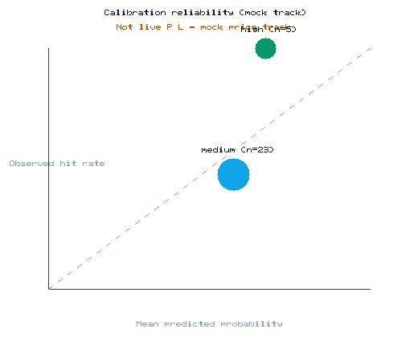

# Chronos outcome metrics

Generated by [`scripts/generate_outcomes_doc.py`](../scripts/generate_outcomes_doc.py) from
[`backend/app/data/resolved_predictions.json`](../backend/app/data/resolved_predictions.json).

Last generated: 2026-08-29 08:41 UTC

## Summary

| Metric | Value |
|--------|------:|
| Resolved predictions (n) | 28 |
| Mean Brier score | 0.2167 |
| Resolution accuracy | 57.1% |
| Skip/abstain rate | 20.0% |
| Total pipeline decisions | 35 |
| Abstained (skip) decisions | 7 |

## Calibration reliability

| Bucket | Samples | Mean predicted | Observed hit rate | Calibration gap |
|--------|--------:|---------------:|------------------:|----------------:|
| medium | 23 | 57.6% | 47.8% | 9.7% |
| high | 5 | 67.4% | 100.0% | 32.6% |

## Notes

- **Brier score** averages `(calibrated_p - outcome)^2` over resolved predictions only.
- **Skip/abstain rate** is the share of pipeline decisions that did not promote a lead
  (`action=skip`), including confidence/EV guards and daily-cap displacement.
- Records are point-in-time resolver exports on the mock price track; they measure
  calibration quality, not trading P&L.
- Regenerate this page and the PNG with `python3 scripts/generate_outcomes_doc.py`.
